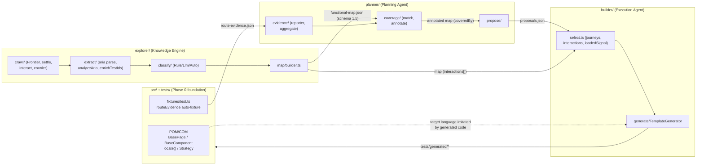

# Full Codebase Architecture & Quality Audit (Fable 5 — final document-phase task)

**Date:** 2026-07-06
**Model:** Fable 5 (last assignment before retirement from this workflow — see CLAUDE.md "Model routing policy")
**Status:** Diagnostic only. **No code changes.** Nothing here becomes a spec without Jorge's confirmation.
**Baseline:** `master` @ `b9c44b0` (M9 merged). Canonical map: `coverage/functional-map.json`, schema 1.5, 149 pages / 6,116 elements / 149 flows / 168 interactions / 2.6 MB.
**Ground truth ingested:** CLAUDE.md, `docs/roadmap/2026-07-02-platform-roadmap.md`, `docs/roadmap/2026-07-02-backlog.md`, findings doc §1–§17, and the full source of `src/`, `explorer/`, `planner/`, `builder/`, `tests/`. All numeric claims below were measured directly against the committed map, not estimated.

**Explicitly NOT flagged (confirmed deliberate, live-validated decisions — do not reopen):** `waitForTimeout`-based act→verify→retry loops (A3), `workers: 1`/`retries: 1` (findings §7), deterministic path-before-text classification (B13), testId-tier deprioritization instead of exclusion (B14/B16).

---

## 1. Architecture breakdown

### 1.1 The four sub-projects and the data pipeline



Data contracts between stages, all file-based JSON, all versioned or timestamped:

| Producer | Artifact | Consumer | Contract |
|---|---|---|---|
| `pnpm explore --update` | `coverage/functional-map.json` | planner, builder | `FunctionalMap` (schema 1.5, `explorer/map/schema.ts`) |
| `pnpm test` (routeEvidence fixture + `planner/evidence/reporter.ts`) | `reports/route-evidence.json` | planner | `RouteEvidence` (per-attempt URL trails) |
| `pnpm plan` | annotated map (`coveredBy`) + `reports/planner/proposals.json` | builder | `PlanReport` (ranked uncovered flows) |
| `pnpm build-tests` | `tests/generated/*` (gitignored drafts) | human review → promotion | generated code imitating the POM/COM contract |

Dependency direction is clean and one-way: `src/` (base layer) ← `explorer/` ← `planner/` ← `builder/`. No cycles (enforced by `import/no-cycle` at error level); the shared vocabulary (`TestIdHint`, `TESTID_ATTRS`, `Strategy`) lives in `src/support/locators.ts` exactly so producer (explorer) and resolver (generated code) cannot disagree — the M7 lesson institutionalized.

### 1.2 Schema evolution of `coverage/functional-map.json`

| Version | Milestone | What it added |
|---|---|---|
| 1.0 | M2 | Relational base: pages/components/elements/forms/flows cross-referenced by stable sha1-derived ids (`explorer/ids.ts`) |
| 1.1 | M4 | `MapFlow.steps` carries the full root→leaf navigation chain reconstructed from `discoveredVia`; `MapFlow.name` = human-readable path chain |
| 1.2 | M5/M5b | `MapFlow.coveredBy?: string[]` — evidence-based coverage annotation (empty array = evaluated, uncovered) |
| 1.3 | M7 (B15) | `SelectorHints.testId` became `TestIdHint { attr, value }` — attribute provenance for `data-testid`/`data-qa-anchor`/`data-qa` |
| 1.4 | B14 | `MapElement.component?: 'Header' \| 'Footer' \| 'MiniCart'` — shared-chrome provenance from landmark ancestry |
| 1.5 | M8 | Top-level `interactions[]` (`MapInteraction`: trigger→outcome→revealed) + `MapElement.revealedBy?` back-links |

Bump discipline is additive-only, no migration code (map regenerated live each time) — a deliberate, documented trade-off that holds while the map is cheap to regenerate. One consequence worth naming: `planner/coverage/annotate.ts:27` stamps `SCHEMA_VERSION` unconditionally on whatever map it annotates, so `pnpm plan --update` against a stale 1.4 map would silently label it 1.5 without any structural upgrade. Minor footgun, zero observed impact (the map has always been regenerated first).

### 1.3 The POM/COM contract — the Builder's target language

The generated code imitates exactly four framework idioms, all boring and uniform by design (roadmap §2's "every irregularity is a special case a generator must learn later"):

1. **`BasePage.goto()`** — the single navigation chokepoint: pre-seeds `bsk_onboarding`, waits only `domcontentloaded` (hydration is the caller's problem, by doctrine).
2. **`BaseComponent`** — always root-`Locator`-scoped, never page-global.
3. **`locate(scope, Strategy)`** — the priority order testId→role→label→placeholder, with `TestIdHint.attr` deciding `getByTestId()` vs raw CSS attribute locator (shadow-DOM-piercing).
4. **Act→verify→retry** — every state-changing interaction loops against a wall-clock deadline; verification is a *state observation* (URL reached, dialog open/closed, count changed), never the click's own promise.

The contract has held: `TemplateGenerator` emits nothing a hand-written page object wouldn't contain, and both M9 live bugs were fixed *inside the template* (baseline dialog-count diff; baseline captured in `openOverlay()` post-hydration), keeping the contract uniform.

---

## 2. Findings

Each finding cites file/line or the doc section it engages with, and states risk, complexity, and whether a fix would change documented behavior (⚠ = STOP, needs human review before any spec).

### F1. [Nuevo — root-caused here] Duplicate `MapElement.id`: id generation has no occurrence discriminator

**The open observation from findings §17, now root-caused.** `explorer/map/builder.ts:54`:

```ts
id: makeId('elem', pageId, el.role, el.label, el.type)
```

Two elements on the same page with the same role+label+type get the *same id*, and `analyzeAria.ts` deliberately pushes every matching aria node without dedup — so a PLP grid with 27 identical "Añadir a la lista de deseos" buttons yields 27 elements with one id. Measured against the committed map:

- **830 duplicate ids, 1,968 excess element rows — 32% of the 6,116-element table is redundant.**
- Worst offenders are all per-card grid buttons (27×/26×/26×… "Añadir a la lista de deseos" on single PLP pages).
- **127 duplicate instances are *not* byte-identical to their first occurrence**: 78 diverge in `selectorHints.testId` (the `enrichTestIds` cap of 40 probes + `.first()` resolution means early instances get hints and later ones don't), 49 diverge in `component` (same label appearing both in chrome and page body).

Consequences, in decreasing severity:
1. **Silent data loss on lookup.** Every `byId` consumer resolves an arbitrary instance. `builder/select.ts:172`'s first-match `.find()` documents this and is safe for M9's case, but the 127 divergent duplicates mean "first match" can return an instance whose hints differ from the element that actually produced an interaction.
2. **The differ degrades.** `diffCollection` (`explorer/diff/differ.ts:10-24`) builds `Map`s keyed by id — duplicates collapse to the *last* instance, so crawl-to-crawl changes in duplicated elements produce spurious or missed `changed` entries, and one map having 27 instances vs. the next having 24 is invisible. The CI diff gate's (C12) signal quality is quietly capped by this.
3. **Duplicates burn the extraction budget.** `MAX_ELEMENTS_PER_PAGE = 60` (`analyzeAria.ts:7`) is consumed by repeats — 8/149 pages sit at the cap — crowding out *unique* page knowledge. This also undermines B16 (see F7).
4. Map bloat (~32% of the largest table) — cosmetic at 2.6 MB, compounding at 10× scale.

**Fix direction (needs its own spec cycle — schema-affecting ⚠):** either (a) dedup identical elements at analysis time and add a `count` field (`MapElement.count?: number`), or (b) suffix ids with an occurrence index. Option (a) is strictly better: it shrinks the map, makes the differ meaningful, frees the 60-element cap for unique knowledge, and makes B16's uniqueness count exact (F7). **Risk if unaddressed:** every future agent consuming elements (Selector Healing, Phase 7 — whose entire job is per-element hint quality) inherits ambiguous lookups. **Complexity:** medium. **Changes documented behavior:** yes — all committed element ids change wholesale (one-time diff-baseline reset, same precedent as every schema bump), and `selectInteractionJourneys`'s documented first-match tolerance becomes unnecessary. STOP for human review.

### F2. [Nuevo] The differ ignores `interactions[]` entirely

`explorer/diff/differ.ts:26-34` diffs pages, components, elements, forms, flows — and was never updated for schema 1.5: `interactions` is not diffed, `DiffKind` has no `'interaction'` member. The CI diff gate (C12) is therefore blind to interaction drift — the exact knowledge class M8/M8b/M9 were built to capture (e.g. DES removing the Tallas dialog would produce *zero* diff signal beyond the revealed elements disappearing). **Risk:** the platform's newest knowledge type is unmonitored. **Complexity:** trivial (one `diffCollection` call + one union member + a unit test). **Changes documented behavior:** no.

### F3. [Nuevo] Redirect-duplicate pages pay full extraction cost before being discarded

`explorer/crawl/crawler.ts:76-92`: the settle wait (3.5–10 s), the full aria extraction, *and* `enrichTestIds` (up to 40 role-locator probes × 3 attributes × 250 ms timeout each) all run **before** the resolved-path dedup check discards a redirect duplicate. The resolved path is available from `page.url()` immediately after `goto` + `acceptConsent` — moving the `markSeen` check there skips the whole per-page cost for duplicates with byte-identical crawl output. On a gate-heavy site where redirects are common (the exact reason `markSeen` exists — findings §8), this is real minutes at full-crawl scale, against the crawl's known wall-clock ceiling (the 150-page bound already exits time-bound at ~106 pages, §15). **Risk if unaddressed:** none functional, pure waste. **Complexity:** small. **Changes documented behavior:** no (output-identical).

### F4. [Nuevo] Flow-chain reconstruction silently truncates across server-side redirects

`explorer/map/builder.ts:99-121`: children are enqueued with `discoveredVia: item.path` (the parent's *requested* path — `crawler.ts:116`), but `nodeByKey` indexes parents under their *resolved* `meta.path`. When a parent was redirected (requested ≠ resolved), every child's chain lookup misses, the `while` loop ends, and the flow's chain silently starts mid-journey instead of at a seed — no warning, no marker. This corrupts exactly the knowledge M4 exists to provide (real root→leaf chains), and a truncated chain also perturbs coverage matching (F5) and the Builder's generated `open()` navigation. **Risk:** silent knowledge corruption on a site whose entry gates redirect by design. **Complexity:** small-medium (index parents under both paths, or emit a builder warning when a chain terminates on `discoveredVia !== 'seed'` — the warning alone would make the blast radius measurable before choosing a fix). **Changes documented behavior:** the warning, no; the re-indexing changes flow contents — needs live re-validation of the flow layer. ⚠ for the fix, not for the warning.

### F5. [Ya documentado — en desacuerdo con la gestión, no con el diagnóstico] 0/149 coverage is a structural defect of the map↔evidence contract, not ambient noise

Findings §9/§12/§13/§15/§16/§17 all attribute the `0/N flows covered` results to "this crawl's discovery order roots every flow at `/`, which the specs never visit" — correct diagnosis every time, and each time correctly ruled *not caused by that session's milestone*. The disagreement is with the disposition: after **four consecutive milestones** producing the same 0-coverage outcome, this is not crawl-to-crawl variability — it is a deterministic incompatibility. The crawler's seeds (`explorer/cli.ts:18`: `'/', '/es/', '/es/search'`) mean discovery can root at `/`; the specs navigate from the `/es/` locale root per `BASE_URL` doctrine; `isOrderedSubsequence` (`planner/coverage/match.ts`) requires the *entire* chain including the never-visited root. Consequences today: `coveredBy` has been empty since M7b, so the planner's ranking degrades to priority+steps-length only (D14's "let proposals drive spec-writing" runs on a ranking that measures nothing), and M5b's headline capability — evidence→map linkage, the seed of Phase 8 — has been dark for three sessions.

**Recommendation:** file this as a numbered backlog item (it currently exists only as repeated per-section footnotes) and give it a spec cycle. Candidate directions, deliberately not chosen here: (a) drop `/` from the seed list (smallest change; `/es/` discovers the same tree on this site), (b) trim un-navigated seed-root prefixes at match time, (c) match on chain suffix. **Risk if unaddressed:** the Planning Agent (Phase 4) stays functionally unvalidated in its core value proposition. **Complexity:** small (a) to medium (b/c). **Changes documented behavior:** yes — coverage semantics; needs Jorge + live validation. ⚠

### F6. [Nuevo] The offline DOM extraction path drifted from `TESTID_ATTRS`

`src/support/locators.ts:5-8` declares the three-attribute list as *shared* "so producer and resolver can never disagree." The aria producer honors it (`enrichTestIds.ts:21` iterates `TESTID_ATTRS`), but the offline DOM producer does not: `explorer/extract/hints.ts:24-27` probes only `data-testid` and `data-qa` — **`data-qa-anchor` is missing**, which is the one attribute confirmed live as DES's dominant test-id carrier (§12). Impact today is offline-only (`dom` mode never runs against DES), but this is a concrete instance of the standing maintainability risk of the dual extraction path: two parallel implementations of the same heuristics (`analyze.ts` vs `analyzeAria.ts`, `hintsFor` vs `enrichTestIds`, two `componentFor` implementations) with no shared conformance test. **Fix:** iterate `TESTID_ATTRS` in `hintsFor` (trivial), plus one shared unit test asserting both producers emit the same hint for the same logical element (small). **Changes documented behavior:** no.

### F7. [Ya documentado — en desacuerdo parcial con el cierre de B16] The uniqueness check is bounded by extraction truncation

B16's fix (`builder/select.ts:73-81`) counts a testId's occurrences *among the map's elements for the page* and requires exactly 1. Two mechanisms make that count an undercount of the live DOM: the 60-element extraction cap (8/149 pages are saturated, and duplicates burn slots — F1), and crawl-time hydration variance (the aria tree at extraction may show one exemplar of a grid that renders 38 live). A testId that repeats in the DOM but survives into the map exactly once passes the `=== 1` check, and the original strict-mode violation recurs. **Not reopening B16** — the shipped fix was correct and live-validated for the observed case; this is its honest residual envelope, worth one line in the backlog rather than silence. Note that F1's fix direction (a) (dedup + `count` field) makes this exact for free — another reason to prefer it. **Complexity:** absorbed by F1. **Changes documented behavior:** no (tightens an existing guard).

### F8. [Nuevo] The act→verify→retry idiom is hand-rolled seven times

`SearchBar.search()`, `ProductPage.selectFirstSize()`, `ProductPage.addToCart()`, `ProductCard.open()`, `SearchResultsPage.waitForResults()`, and the generated `openOverlay()`/`closeOverlay()` templates each re-implement the same deadline-loop shape (deadline arithmetic, `dismissOnboardingTour`, swallowed action, fixed sleep, verify, diagnostic throw) with small accidental variations (500 ms vs 1,000 ms sleeps, differing deadline composition). **To be explicit: this proposes centralizing the pattern, not removing it — A3's reclassification stands untouched.** A single `src/support/retry.ts` helper (`await actUntil({ act, verify, deadlineMs, sleepMs, onTimeout })`) would make the framework's most important rule a named, single-point-of-change primitive — directly serving the roadmap's "keep the contracts boring and uniform" mandate, and giving `TemplateGenerator` one import instead of an inlined loop body. **Risk if unaddressed:** low today; grows with every new page object and every template variant. **Complexity:** medium — mechanically simple, but it touches every live-validated interaction path, so it mandates a full live re-validation pass (`pnpm test` + `pnpm test:generated`) and should not ride along with any other change. ⚠ (behavior-preserving by intent, but the files are the framework's most battle-tested — human call on whether the consolidation is worth the re-validation cost now or after A5.)

### F9. [Nuevo] Builder never checks proposals↔map staleness

`builder/cli.ts` reads `proposals.json` and the map independently. `PlanReport.mapGeneratedAt` exists precisely to identify which map the proposals were computed from, but nothing compares it to `map.generatedAt` — a re-crawl between `pnpm plan` and `pnpm build-tests` surfaces only as N confusing per-proposal "references a page id missing from the map" skips instead of one clear "proposals are stale, re-run pnpm plan" error. **Complexity:** trivial. **Changes documented behavior:** no.

### F10. [Nuevo, menor] `tests/generated/` accumulates stale drafts across sessions

`pnpm build-tests` only ever adds files; nothing removes drafts generated from superseded maps. `pnpm test:generated` runs the whole accumulated corpus (already 20 specs by M8's validation), so a future red run may mean "old draft rotted via catalog drift," not "generator regressed" — mudding exactly the signal the command exists to give. **Fix direction:** a `--clean` flag, or a manifest of the current generation the test command filters by. **Complexity:** small. **Changes documented behavior:** no (drafts are documented as disposable).

### F11. [Nuevo, menor] Extraction truncation is silent

When a page hits `MAX_ELEMENTS_PER_PAGE`, nothing records it — the map cannot distinguish "this page has 60 elements" from "this page has 200 and we kept 60." One boolean (`PageExtraction.truncated`) or a total count would make the knowledge gap visible to consumers (and to F7's risk assessment). Schema-additive. **Complexity:** trivial-small.

### F12. [Nuevo, menor] Crawl-report shape ≠ canonical-map shape

`explorer/cli.ts:64` writes reports as `{ map, errors }` but `--update` writes the bare map. Findings §15 records a real session hand-copying a report into `coverage/functional-map.json` — which requires knowing to unwrap `.map`. A `--from-report <path>` CLI flag (or writing reports as sibling files `<stamp>.map.json` + `<stamp>.errors.json`) removes the footgun. **Complexity:** small.

### Scalability notes (no action needed now, register for the 10× moment)

- **The binding constraint is crawl wall-clock, not data size.** 2.6 MB / 6k elements is trivial for the in-memory JSON pipeline (planner and builder both load everything; the differ JSON.stringifies per element) — all fine to ~10×. But the crawl already exits time-bound (106 pages captured under a 150-page bound, §15), and there is **no incremental or resumable crawl**: a VPN drop mid-crawl loses everything (the empty-map guard prevents *clobbering*, not *loss*). Before the map is expected to grow materially past ~200 pages, "resume from the last crawl's frontier" or per-session checkpointing earns its keep. F1 (−32% elements) and F3 (skip redirect waste) are the cheap headroom to take first.
- **Type-safety seam to watch:** `SelectorHints.role.type` is `string` (explorer side) while `Strategy.role.type` is Playwright's `Role` union, bridged by unchecked casts (`builder/select.ts:32,48`). Today's extractors only emit valid roles (`elementTypeFor` filters to button/checkbox/dialog/combobox); a future extractor change could generate specs with invalid roles that fail only at runtime. A one-line runtime guard at the cast site (or narrowing `SelectorHints.role.type` itself) closes it.
- The config-per-agent pattern (`loadExplorerConfig`: defaults + env + overrides, fail-fast) is consistent and healthy; the `RegExp[]` in `InteractionsConfig` is non-JSON-serializable, which is fine now but rules out config round-tripping later — note, not a problem.

---

## 3. Refactoring strategy — proposed sequencing (pending Jorge)

| Order | Items | Why this grouping | Behavior change? |
|---|---|---|---|
| 1 | **F2, F9, F6, F11, F12 — done (2026-07-12)** | Trivial, independent, zero doctrine contact, each closed a real blind spot. Shipped as one small "hygiene" milestone (all five items, including F12 — not just opportunistically). | No |
| 2 | **F3** | Small, output-identical, buys crawl-time headroom before any bigger crawl work. | No |
| 3 | **F1 + F7 (+ F4 warning)** | The element-identity spec cycle: dedup + `count` field fixes duplicate ids, makes B16 exact, frees the extraction cap, and shrinks the map ~32%. F4's warning ships alongside to measure chain-truncation blast radius. Full re-crawl + diff-baseline reset + live validation. | ⚠ Yes — schema + committed ids |
| 4 | **F5** | The coverage-contract spec cycle. Restores the planner's actual value proposition; should be decided (a/b/c) with live evidence. | ⚠ Yes — coverage semantics |
| 5 | **F8** | Consolidation of the retry idiom, alone in its own branch, with a full live re-validation pass. Optional; defer freely. | ⚠ Intent-preserving, but touches validated paths |

A5 and A6 (both closed 2026-07-12, unrelated to this audit) were the actual next milestones that landed before this group — nothing above competed with them. B17 (=F1) and F18 (=F5) are now the natural next candidates; items 3–4 above are their audit-doc cross-references.

## 3.1 Order-1 resolution note (2026-07-12)

Implemented directly (TDD, no separate spec/plan cycle — the fixes were already fully specified by this audit's own §2 findings text, so a fresh design cycle would have re-derived what's written there). All five items shipped in one commit:

- **F2** — `explorer/diff/differ.ts` now diffs `interactions[]` (new `DiffKind` member `'interaction'`); the CI diff gate is no longer blind to M8/M8b/M9's newest knowledge class.
- **F9** — `builder/select.ts` gained `mapIsStale(report, map)`; `builder/cli.ts` now fails fast with one clear error instead of N confusing per-proposal skips when `proposals.json` and the map disagree on `generatedAt`.
- **F6** — `explorer/extract/hints.ts` (offline DOM path) now iterates the shared `TESTID_ATTRS` constant, closing the `data-qa-anchor` gap versus the live aria path (`enrichTestIds.ts`).
- **F11** — `PageExtraction.truncated?: boolean` (set by `analyzeAria.ts` when the 60-element cap is hit) now propagates onto the committed `MapPage.truncated`. **Schema bumped 1.5 → 1.6, additive only, no live re-crawl performed** — matches every prior additive bump's precedent; the committed canonical map keeps `schemaVersion: "1.5"` until its next natural re-crawl (not forced here, since this finding was explicitly rated "Behavior change? No" in the table above).
- **F12** — `explorer/args.ts`/`explorer/cli.ts` gained `--from-report <path>`: skips crawling and reuses a previously-written `{ map, errors }` report, closing the footgun of hand-copying `.map` out of a report into the canonical map path (already caused a real mistake once, findings §15). Shipped as part of this pass, not deferred as merely "opportunistic."

**A genuine internal contradiction was found and resolved before implementing F11:** §4 below originally read "(F1/F11 explicitly gated)," grouping F11 with F1/B17 as needing its own dedicated spec cycle — contradicting this table's own "Order 1 / trivial / No behavior change" classification for F11. Flagged to Jorge directly; resolved in favor of the Order-1 classification (F11's change is genuinely additive — an optional field, no live re-crawl, no reinterpretation of existing data — unlike F1/B17's wholesale id-changing rewrite). §4 corrected below to remove the stale reference.

## 4. Non-goals (restated)

No functional changes proposed for items still pending (Orders 2–5). No changes to the DES interaction-reliability patterns (A3 doctrine untouched — F8 centralizes, never removes). No *disruptive* schema change (id reshaping, semantic reinterpretation) happens without a dedicated spec cycle — that gate is **F1/B17** specifically, not every schema-additive item (F11 shipped in Order 1, see §3.1). Anything marked ⚠ in the table above still stops for human review before becoming a spec.

## 5. After this audit

This is Fable 5's final document-phase assignment in this project. Any spec/plan/brainstorm work this audit generates runs on **Claude Opus 4.8**; any resulting implementation on **Claude Sonnet 5** (CLAUDE.md "Model routing policy", 2026-07-06). Findings F1 and F5 are the two candidates worth a numbered backlog entry immediately; the rest can wait for their sequencing slot.
